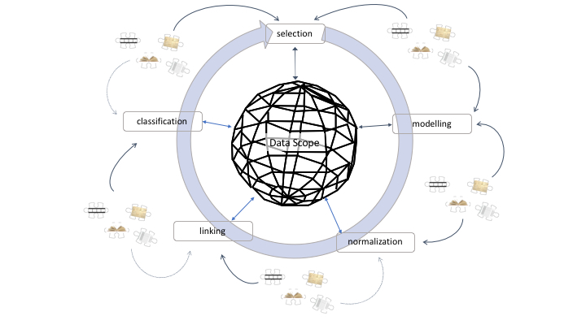

# Data Scopes

- Coherent methods for using digital data in humanities research
- Data scope: you want to analyse a certain aspect of your materials,
    - but the "raw" data is not suitable for direct analysis.
- You have to do something with the data. Questions:
    - What do I have to do to make data suitable?
    - How do I do that?
    - What should I document of this process to I can share it with others?
    - Which parts of this process are specific to my analysis and which are generically applicable?

## Example: project Legal Structures

- Analyse networks of internal references in national constitutions
- Investigate relations between network structure and legal, social and political variables
- Questions:
    - Which constitutions? Only current or only first or all versions? What counts as a version?
    - When are two constitutions representing the same country?
    - What elements are we identifying in each constitution? References, logical structure of constitutions (
    - Only internal references or also external? What counts as a reference? 

## Focus on data interactions
- It's not about specific tools
    - Many tutorials online for that, e.g. the excellent [Programming Historian](https://programminghistorian.org)
- It's about what you're doing, how and why
- Translating research questions, assumption and interpretations to data interactions
- Consequences of interactions for questions, assumptions and interpretations

## Frameworks

- Data Scope: select, model, normalise, link, classify
- Other models focusing on process:
    - [Scholarly Primitives](https://www.google.com/sheets/about/) (John Unsworth): discover, annotate, compare, refer, sample, illustrate, represent
    - [Data Visualization](https://www.google.com/sheets/about/) (Ben Fry): acquire, parse, filter, mine, represent, refine, interact

## Data Scope Schema

### Modelling

- "Heuristic process of constructing and manipulating models" (McCarty, 2004)
- Model: 
    - "a representation of something for purposes of study,"
    - "or a design for realizing something new"
- Model determines what aspects of data to focus on
    - Structures data in sources around research focus
    - Transforms data, affects interpretation!

### Data axes

- Defining data axes: 
    - Persons, organisations, locations, dates, topics, 
    - Themes, life courses, events, actions, decisions
- Defining categories or classes along those axes: 
    - Roles of people and organisations
    - Periods, regions
    - Research stages:
- Model is updated as research progresses
    - This updating reflects growing insights

## Selecting

- Which materials do I include? Which data elements do I focus on?
    - Data axes
- Algorithmic selection:
    - Everything matching a (set of) keyword(s)
    - Documents by type, creator, title, size, ...
- What are consequences of these selections?
    - What am I excluding?

## Normalizing

- Bringing surface forms expressed in data back to an underlying standard form
- Map variation onto a single representation:
    - E.g. linguistic variation, geographical and spatial variation
    - What is irrelevant variation?
    - Essential for next step: linking

## Linking

- Establishing explicit connections between objects in the data sources that are not there from the beginning
    - Connecting representations of a single element across different documents or data sets
    - Connection different elements through relations
- Linking within a corpus:
    - Relations between people, between people and events, between topics and dates, ...
- Linking across different corpora:
    - E.g. mentions of same person, location, date, ...
    - Can bring together disparate data about single entity from different sources
- Allows querying across different types of source materials

## Classifying

- Reduction of complexity by grouping (data) objects into predefined categories, or classes
    - Bringing together objects with similar properties
    - Separating objects with unlike
- Adds new layers of structure and interpretation to data
    - Especially useful for low-frequency items
    - Many data axes have "long tails" which are hard to structure
- Facets
    - multiple, indepdent classifications that can be combined
    - allows very flexible selection and querying

## Domain and subject expertise

- All these activities require both:
    - Technical know-how of how digital tools handle data
    - Intimate knowledge of the domain and subject of source materials
- But also:
    - Reflection on how choices are informed by prior knowledge and experience
    - Reflection on how choices put emphasis on some aspects, while pushing back others
- Often requires collaboration...
    - How to organise that
- ... and lots of discussion
    - Choices that one collaborator makes should be visible to the rest

#

[Back to main program](programma_dag1.md)

